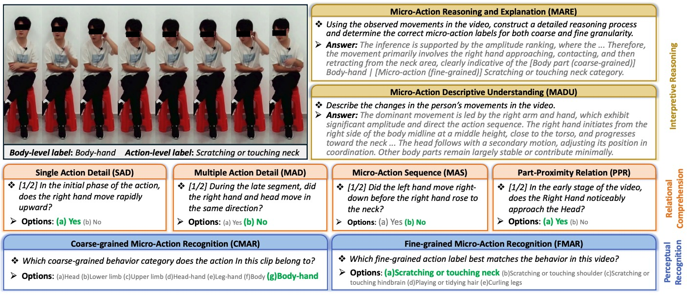
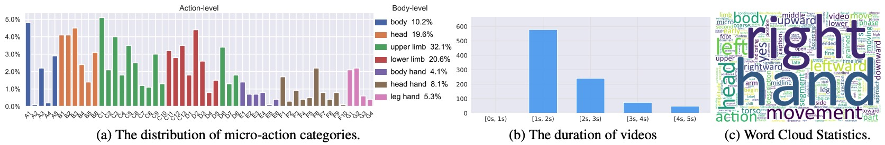
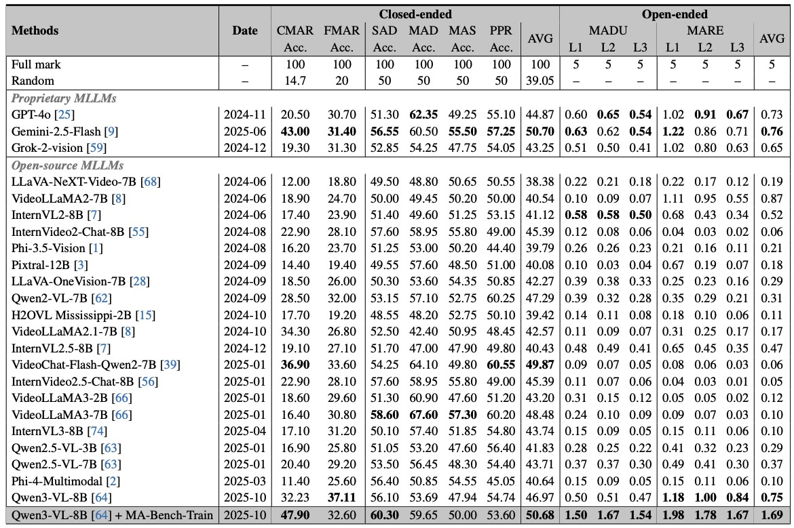

# MA-Bench

<div align="center">
<h1>MA-Bench: Towards Fine-grained Micro-Action Understanding</h1>

[**Kun Li**](https://scholar.google.com.hk/citations?user=UQ_bInoAAAAJ)<sup>1</sup>, [**Jihao Gu**](https://momiji-bit.github.io/)<sup>2</sup>, [**Fei Wang**](https://scholar.google.com/citations?user=sdqv6pQAAAAJ)<sup>3,4</sup>, [**Zhiliang Wu**](https://openreview.net/profile?id=~zhiliang_wu1)<sup>5</sup>, [**Hehe Fan**](https://scholar.google.com/citations?user=hVuflMQAAAAJ)<sup>5</sup>, [**Dan Guo**](https://faculty.hfut.edu.cn/gd/en/index.htm)<sup>3,4</sup>

<sup>1</sup>CVLab, College of Information Technology, United Arab Emirates University  
<sup>2</sup>University College London &nbsp;&nbsp; <sup>3</sup>Hefei University of Technology  
<sup>4</sup>Institute of Artificial Intelligence, Hefei Comprehensive National Science Center  
<sup>5</sup>CCAI, Zhejiang University

[](https://arxiv.org/abs/2603.26586)
[](https://huggingface.co/datasets/kunli-cs/MA-Bench)
[](https://ma-bench.github.io/)


</div>


## 🔥 News

- **`[2026/02/21]`**: [MA-Bench](https://MA-Bench.github.io/) is accepted by **CVPR 2026**.


## Abstract

With the rapid development of Multimodal Large Language Models (MLLMs), their potential in Micro-Action understanding, a vital role in human emotion analysis, remains unexplored due to the absence of specialized benchmarks. To tackle this issue, we present MA-Bench, a benchmark comprising 1,000 videos and a three-tier evaluation architecture that progressively examines micro-action perception, relational comprehension, and interpretive reasoning. MA-Bench contains 12,000 structured question–answer pairs, enabling systematic assessment of both recognition accuracy and action interpretation. The results of 23 representative MLLMs reveal that there are significant challenges in capturing motion granularity and fine-grained body-part dynamics. To address these challenges, we further construct MA-Bench-Train, a large-scale training corpus with 20.5K videos annotated with structured micro-action captions for fine-tuning MLLMs. The results of Qwen3-VL-8B fine-tuned on MA-Bench-Train show clear performance improvements across micro-action reasoning and explanation tasks. Our work aims to establish a foundation benchmark for advancing MLLMs in understanding subtle micro-action and human-related behaviors.

## Evaluation Tasks


<p align="center">
    
</p>


## 📈 Results


### Data Statistics

<p align="center">
    
</p>

### Model Comparision

<p align="center">
    
</p>


## Citation

If you find this project useful, please consider citing:

```bibtex
@inproceedings{li2026mabench,
    title={MA-Bench: Towards Fine-grained Micro-Action Understanding},
    author={Li, Kun and Gu, Jihao and Wang, Fei and Wu, Zhiliang and Fan, Hehe and Guo, Dan},
    booktitle={Proceedings of the IEEE/CVF Conference on Computer Vision and Pattern Recognition},
    year={2026},
}

@article{guo2024benchmarking,
  title={Benchmarking Micro-action Recognition: Dataset, Methods, and Applications},
  author={Guo, Dan and Li, Kun and Hu, Bin and Zhang, Yan and Wang, Meng},
  journal={IEEE Transactions on Circuits and Systems for Video Technology},
  year={2024},
  volume={34},
  number={7},
  pages={6238-6252}
}
```

## Contact Authors
If you have any questions or suggestions, please open an issue in this repository or contact [Kun Li](mailto:kunli.hfut@gmail.com).
